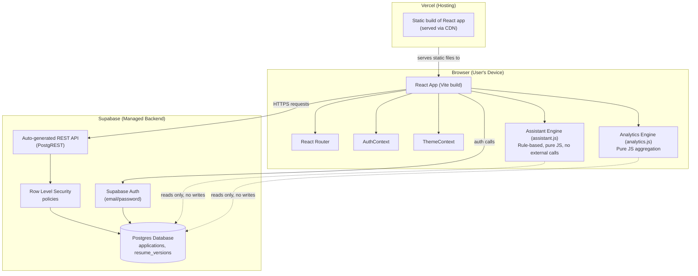
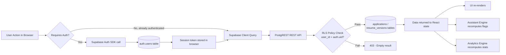
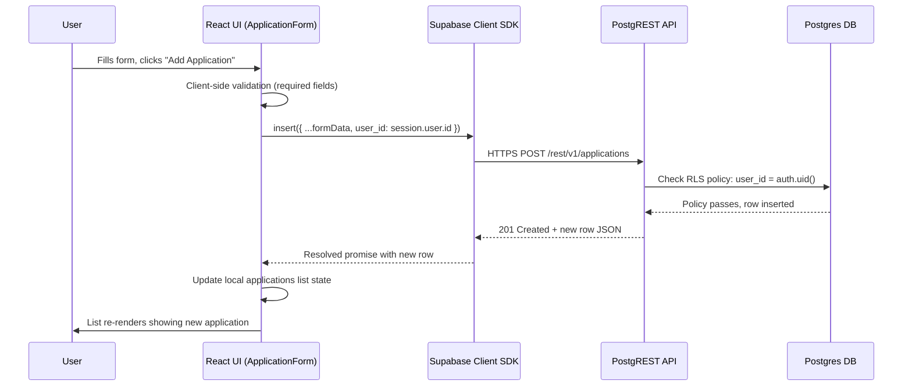
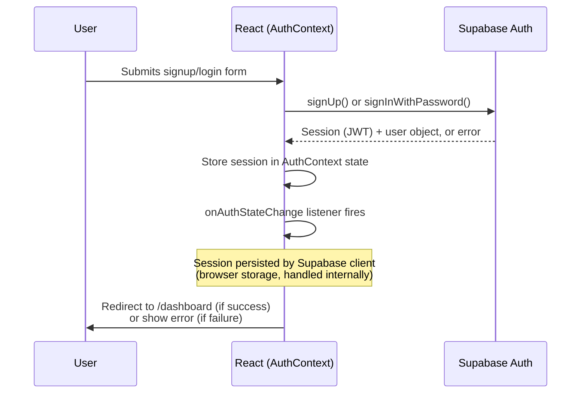
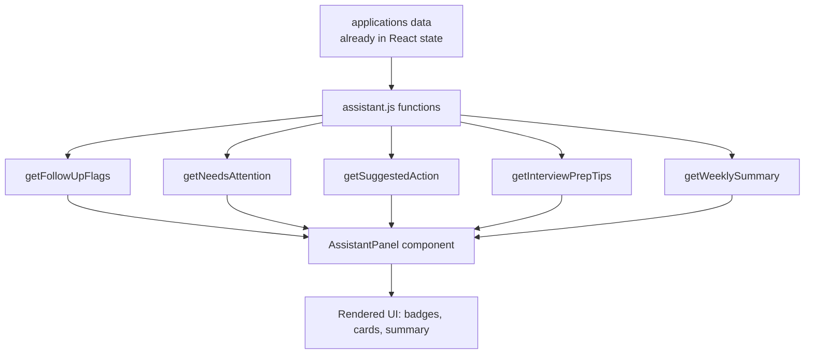

# JobTrack AI — System Architecture

**Status:** Locked for v1.0 — Day 2 Design Document
**Source of truth:** PRD v1.0, Implementation Blueprint (Days 2–10)

This document describes the complete system architecture for JobTrack AI. It does not introduce any new scope beyond the approved PRD — it formalizes the architecture implied by the already-locked tech stack (React + Vite + Tailwind, Supabase, Vercel).

---

## 1. Architectural Overview

JobTrack AI is a **client-heavy, backend-light** application. There is no custom backend server. The React frontend talks directly to Supabase (Postgres + Auth) using the Supabase JavaScript client library. All "AI-powered" logic (the Smart Career Assistant) runs as plain JavaScript functions in the browser, operating on data already fetched from Supabase — no external AI API calls are made.

This is a deliberate simplification, not a limitation: it removes an entire layer (custom backend hosting, API server code, server-side session management) that would otherwise be the highest-risk part of a 10-day beginner build.

---

## 2. Component Diagram

**Key point:** there is no application-owned server between the browser and Supabase. The "backend" is entirely Supabase's managed services.

---

## 3. Data Flow

All reads and writes flow through Supabase's Row Level Security layer — this is what guarantees one user can never see another user's data, without any custom backend authorization code being written.

---

## 4. Request Lifecycle (Example: Adding a Job Application)

---

## 5. Authentication Flow

Protected routes (`/dashboard`, `/resume-versions`, add/edit application pages) check `AuthContext` on render; if no active session, the user is redirected to `/login`.

---

## 6. AI / Smart Career Assistant Interaction

Per the approved PRD, the Smart Career Assistant is **rule-based only** — no external LLM or AI API is called anywhere in this architecture.

All five functions are pure — same input always produces same output, no network calls, no randomness, no external dependency. This satisfies the PRD requirement of "intelligent-feeling but fully deterministic" behavior at zero marginal cost.

---

## 7. External Services

| Service | Role | Data Sent | Notes |
|---|---|---|---|
| **Supabase** | Database + Authentication | User email/password (auth), application/resume records | Free tier; single project used for both dev and production |
| **Vercel** | Static hosting + CI/CD | Built frontend assets only | Auto-deploys on every `git push` to `main` |
| **GitHub** | Version control, triggers Vercel deploys | Source code only (no secrets — `.env` is gitignored) | Single repository for the whole project |

No other external services (no email provider, no LLM API, no analytics/tracking service, no file storage service) are used in v1.0, consistent with the PRD's out-of-scope list.

---

## 8. Environment Variables

| Variable | Used By | Purpose |
|---|---|---|
| `VITE_SUPABASE_URL` | Frontend (Vite build) | Supabase project's API URL |
| `VITE_SUPABASE_ANON_KEY` | Frontend (Vite build) | Supabase public anon key (safe to expose client-side; RLS enforces real security) |

Both are set locally in `.env` (gitignored) and duplicated in Vercel's Project Settings → Environment Variables for production.

---

## 9. Why This Architecture Fits the Constraints

- **Beginner-friendly:** no backend server code to write, deploy, or debug.
- **Secure by default:** RLS policies enforce data isolation at the database layer, not in application code that could have bugs.
- **Fast to ship:** every layer (Supabase, Vercel) is a managed service with a generous free tier and git-based deployment.
- **Matches the 3–4 hr/day budget:** removes an entire category of work (backend architecture, server hosting, API server debugging) from the remaining 8 build days.
