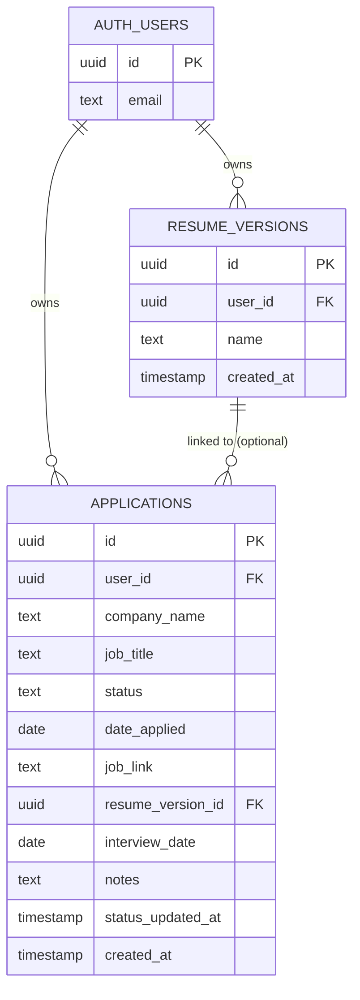

# JobTrack AI — Database Schema

**Status:** Locked for v1.0 — matches the Implementation Blueprint's Day 2 schema exactly, no changes.
**Database:** Supabase (Postgres)

---

## 1. Entity Relationship Diagram



`AUTH_USERS` is Supabase's built-in table (`auth.users`) — not created or modified by this project. It's shown here only to illustrate the ownership relationship.

---

## 2. Table: `applications`

| Column | Type | Constraints | Notes |
|---|---|---|---|
| `id` | `uuid` | Primary Key, default `gen_random_uuid()` | Auto-generated |
| `user_id` | `uuid` | Foreign Key → `auth.users(id)`, `NOT NULL` | Owner of this record; drives RLS |
| `company_name` | `text` | `NOT NULL` | Required per PRD FR-3 |
| `job_title` | `text` | `NOT NULL` | Required per PRD FR-3 |
| `status` | `text` | `NOT NULL`, `CHECK (status IN ('Applied','Assessment','Interview','Rejected','Offer'))` | Matches PRD's five defined statuses exactly |
| `date_applied` | `date` | `NOT NULL` | Required per PRD field list |
| `job_link` | `text` | Nullable | Optional per PRD |
| `resume_version_id` | `uuid` | Foreign Key → `resume_versions(id)`, `ON DELETE SET NULL`, Nullable | Optional link; safely nulls out if the version is deleted |
| `interview_date` | `date` | Nullable | Optional per PRD |
| `notes` | `text` | Nullable | Optional per PRD |
| `status_updated_at` | `timestamptz` | `NOT NULL`, default `now()` | Updated by the app whenever `status` changes; drives Smart Assistant follow-up logic |
| `created_at` | `timestamptz` | `NOT NULL`, default `now()` | Record creation timestamp |

### SQL (for Supabase SQL Editor)

```sql
create table applications (
  id uuid primary key default gen_random_uuid(),
  user_id uuid not null references auth.users(id) on delete cascade,
  company_name text not null,
  job_title text not null,
  status text not null check (status in ('Applied','Assessment','Interview','Rejected','Offer')),
  date_applied date not null,
  job_link text,
  resume_version_id uuid references resume_versions(id) on delete set null,
  interview_date date,
  notes text,
  status_updated_at timestamptz not null default now(),
  created_at timestamptz not null default now()
);
```

> **Note on table creation order:** `resume_versions` must be created *before* `applications`, since `applications.resume_version_id` references it. See Section 4 for full ordered SQL.

---

## 3. Table: `resume_versions`

| Column | Type | Constraints | Notes |
|---|---|---|---|
| `id` | `uuid` | Primary Key, default `gen_random_uuid()` | Auto-generated |
| `user_id` | `uuid` | Foreign Key → `auth.users(id)`, `NOT NULL` | Owner of this record; drives RLS |
| `name` | `text` | `NOT NULL` | e.g. "Software Engineer Resume v1" — text label only, no file storage per PRD |
| `created_at` | `timestamptz` | `NOT NULL`, default `now()` | Record creation timestamp |

### SQL (for Supabase SQL Editor)

```sql
create table resume_versions (
  id uuid primary key default gen_random_uuid(),
  user_id uuid not null references auth.users(id) on delete cascade,
  name text not null,
  created_at timestamptz not null default now()
);
```

---

## 4. Full Ordered Setup Script

Run this exactly, in order, in the Supabase SQL Editor:

```sql
-- 1. resume_versions first (no dependencies)
create table resume_versions (
  id uuid primary key default gen_random_uuid(),
  user_id uuid not null references auth.users(id) on delete cascade,
  name text not null,
  created_at timestamptz not null default now()
);

-- 2. applications second (depends on resume_versions)
create table applications (
  id uuid primary key default gen_random_uuid(),
  user_id uuid not null references auth.users(id) on delete cascade,
  company_name text not null,
  job_title text not null,
  status text not null check (status in ('Applied','Assessment','Interview','Rejected','Offer')),
  date_applied date not null,
  job_link text,
  resume_version_id uuid references resume_versions(id) on delete set null,
  interview_date date,
  notes text,
  status_updated_at timestamptz not null default now(),
  created_at timestamptz not null default now()
);

-- 3. Enable Row Level Security on both tables
alter table applications enable row level security;
alter table resume_versions enable row level security;

-- 4. Policies: applications
create policy "Users can view their own applications"
  on applications for select
  using (auth.uid() = user_id);

create policy "Users can insert their own applications"
  on applications for insert
  with check (auth.uid() = user_id);

create policy "Users can update their own applications"
  on applications for update
  using (auth.uid() = user_id);

create policy "Users can delete their own applications"
  on applications for delete
  using (auth.uid() = user_id);

-- 5. Policies: resume_versions
create policy "Users can view their own resume versions"
  on resume_versions for select
  using (auth.uid() = user_id);

create policy "Users can insert their own resume versions"
  on resume_versions for insert
  with check (auth.uid() = user_id);

create policy "Users can update their own resume versions"
  on resume_versions for update
  using (auth.uid() = user_id);

create policy "Users can delete their own resume versions"
  on resume_versions for delete
  using (auth.uid() = user_id);
```

---

## 5. Schema Validation Against PRD User Stories / Functional Requirements

| PRD Requirement | Satisfied By |
|---|---|
| FR-1, FR-2 — Auth & private user data | `user_id` on both tables + RLS policies restrict all access to `auth.uid()` |
| FR-3 — Create application with all fields | All fields present on `applications` (company, title, status, date, link, resume version, interview date, notes) |
| FR-4 — Edit application | `UPDATE` policy present; `status_updated_at` supports tracking changes |
| FR-5 — Delete application | `DELETE` policy present |
| FR-6 — Filter by status | `status` column with `CHECK` constraint enables reliable filtering |
| FR-7 — CRUD resume versions | Full CRUD policies on `resume_versions` |
| FR-8 — Link resume version to application | `resume_version_id` FK, nullable, `ON DELETE SET NULL` (safe deletion) |
| FR-9, FR-10, FR-11 — Analytics (counts, chart, conversion rates) | All computable client-side from `applications.status` — no schema changes needed |
| FR-12 — Follow-up flags | `status_updated_at` gives the exact data needed for "days since last update" logic |
| FR-13 — Suggested next action | Derived from `status` + `date_applied`/`interview_date` — no new fields needed |
| FR-14 — Interview prep tips | `interview_date` field present |
| FR-15 — Weekly summary | Derived from `date_applied`/`interview_date` filtered to a rolling 7-day window |

**Result: no gaps found.** Every functional requirement from the PRD is satisfiable with this two-table schema. No schema changes are needed today.

---

## 6. Explicitly Out of Scope (Per PRD)

- No `resume_files` or file storage table/bucket — resume versions are name-only records.
- No `notifications` table — all reminders are computed on-the-fly, not stored or scheduled.
- No `teams` or multi-user shared-access tables — each user's data is fully private and independent.
