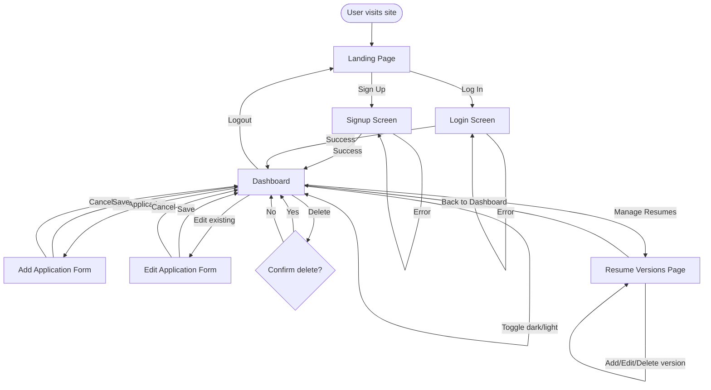
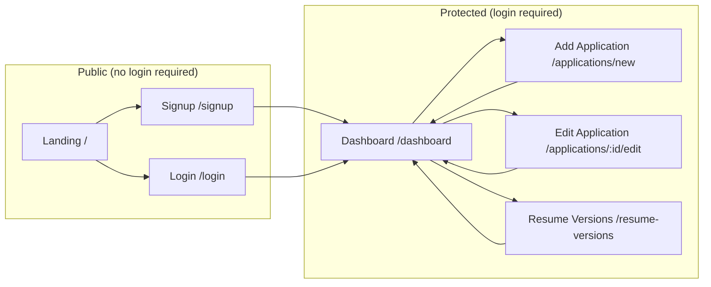
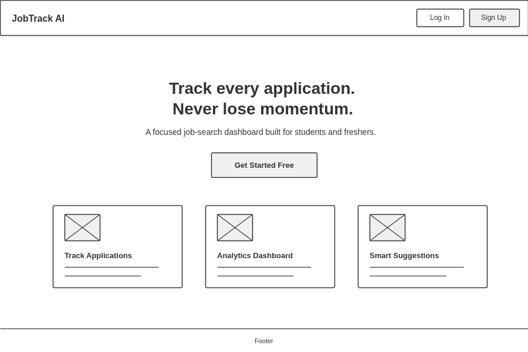
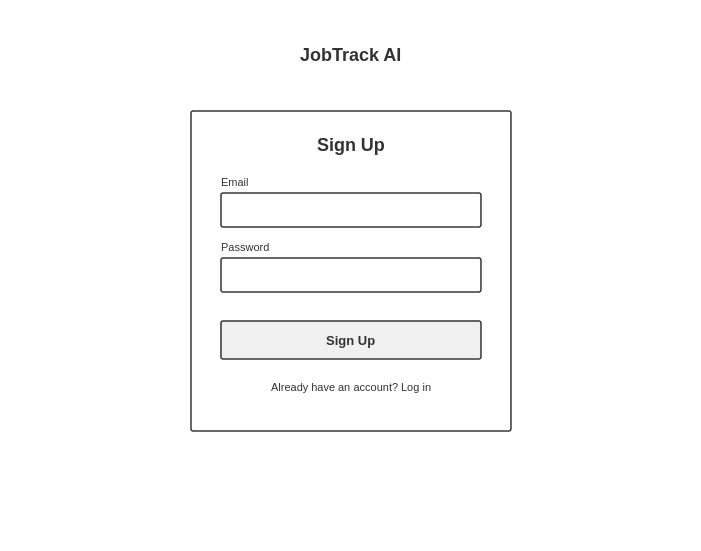
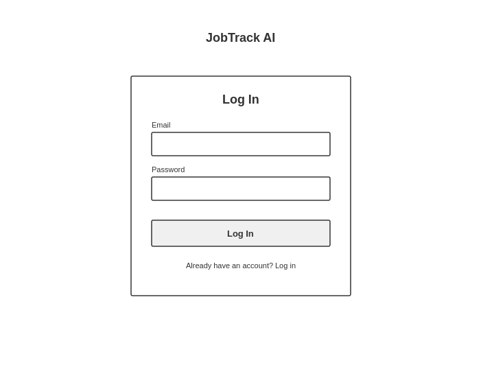
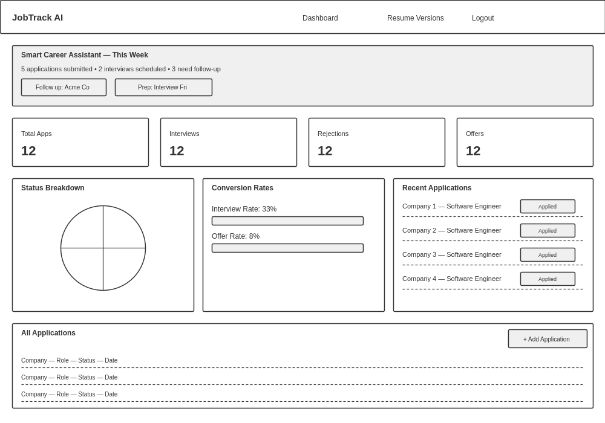
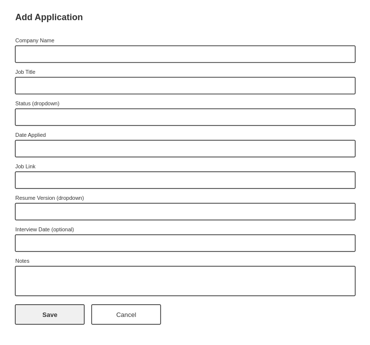
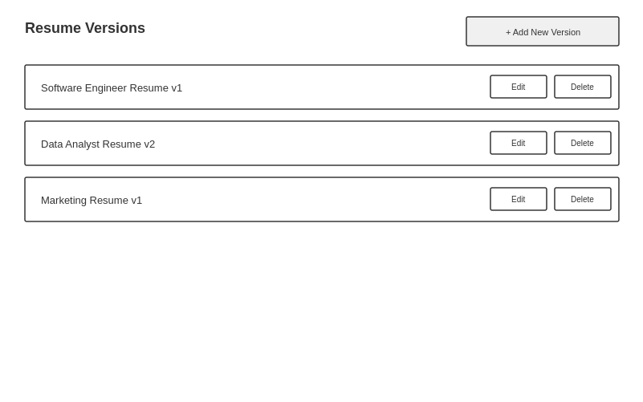

# JobTrack AI — UI & User Flow

**Status:** Locked for v1.0 — Day 2 Design Document
**Fidelity:** Low-fidelity wireframes (structure and hierarchy only — no colors, fonts, or final styling; visual polish happens on Blueprint Day 8).

Every screen below exists to satisfy a specific PRD requirement. No screen is included "just in case."

---

## 1. User Flow Diagram

---

## 2. Screen Flow (Navigation Map)

Route protection: any URL under **Protected** redirects to `/login` if no active Supabase session exists, per the ProtectedRoute component defined in the Implementation Blueprint (Day 3).

---

## 3. Why Each Screen Exists

| Screen | PRD Requirement Satisfied |
|---|---|
| Landing Page | PRD Section 6.1.6 — public page explaining the product with sign up/login entry points |
| Signup | FR-1 — users can create accounts |
| Login | FR-1 — users can log in |
| Dashboard | FR-6, FR-9–FR-15 — application list, analytics, and Smart Assistant Panel, the core daily-use screen |
| Add Application Form | FR-3 — create a new application |
| Edit Application Form | FR-4 — edit an existing application (same component as Add, pre-filled) |
| Resume Versions | FR-7, FR-8 — manage resume version records and enable linking |

No additional screens (settings page, profile page, admin panel, etc.) exist — consistent with the PRD's out-of-scope list.

---

## 4. Wireframes

### 4.1 Landing Page

Public entry point. Explains the product in one headline + subheading, with a single primary CTA ("Get Started Free") and three brief feature highlights. Navbar offers direct Log In / Sign Up access.

---

### 4.2 Signup Screen

Minimal form: email, password, submit. Error messages (e.g. "email already registered") render inline above the submit button — not shown in this low-fi wireframe, but reserved space exists between the password field and button.

---

### 4.3 Login Screen

Same layout pattern as Signup for consistency and lower cognitive load — same field order, same button placement, only the heading and submit label change.

---

### 4.4 Dashboard (Primary Screen)

This is the screen users see most. Top-to-bottom information hierarchy, deliberately ordered:

1. **Smart Career Assistant panel** (top) — the most actionable information first: what needs attention today.
2. **Summary stat cards** — quick pulse-check of overall progress.
3. **Status chart + conversion rates** — deeper analytics, side-by-side.
4. **Recent applications preview** — a glanceable recent-activity list.
5. **Full applications list** (bottom) — complete CRUD table with filtering and "+ Add Application".

This ordering matches the Blueprint's Day 6/Day 7 build sequence: analytics ships first (Day 6), assistant panel is layered in on top (Day 7) and given the most prominent position since it's the product's key differentiator.

---

### 4.5 Add / Edit Application Form

Single reusable form component (per Blueprint Day 4 plan) used in both "Add" and "Edit" modes — Edit simply pre-fills these same fields. Field order matches the PRD's field list exactly: Company Name, Job Title, Status, Date Applied, Job Link, Resume Version, Interview Date (optional), Notes.

---

### 4.6 Resume Versions Page

Simple list-based CRUD screen. Deliberately minimal — per the PRD, this only manages text-label version records, not actual files, so no upload UI exists here.

---

## 5. Responsive & Dark Mode Notes (For Day 8)

These wireframes show desktop layout only, since responsive/dark-mode work is explicitly scheduled for Blueprint Day 8, not Day 2. For reference, the intended mobile adaptations (already anticipated in the Blueprint) are:

- Dashboard's 3-column analytics row collapses to a single stacked column.
- Applications table switches to a card-per-application layout instead of a wide table.
- Navbar collapses to a hamburger-style menu.
- All wireframed layouts above use relative proportions that support this collapse without structural changes.

No new screens or layout structures are introduced by responsive/dark-mode work — only CSS-level adaptation of the screens defined here.

---

## 6. Explicitly Out of Scope

Per the PRD, the following screens/flows are **not** part of v1.0 and do not appear in this document:

- Admin panel
- User profile/settings page
- Resume file upload/preview screen
- Data export screen
- Team/collaboration screens
- Onboarding tutorial/walkthrough screens
